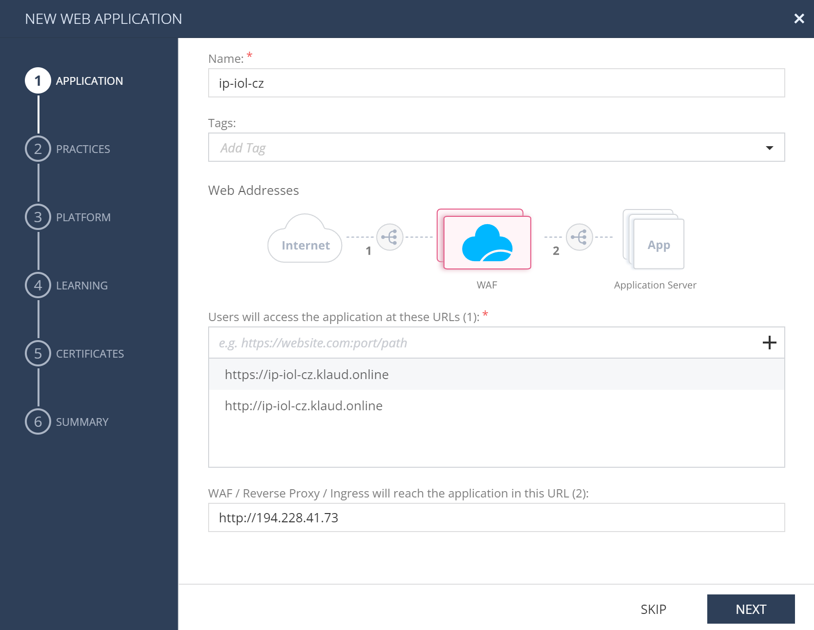
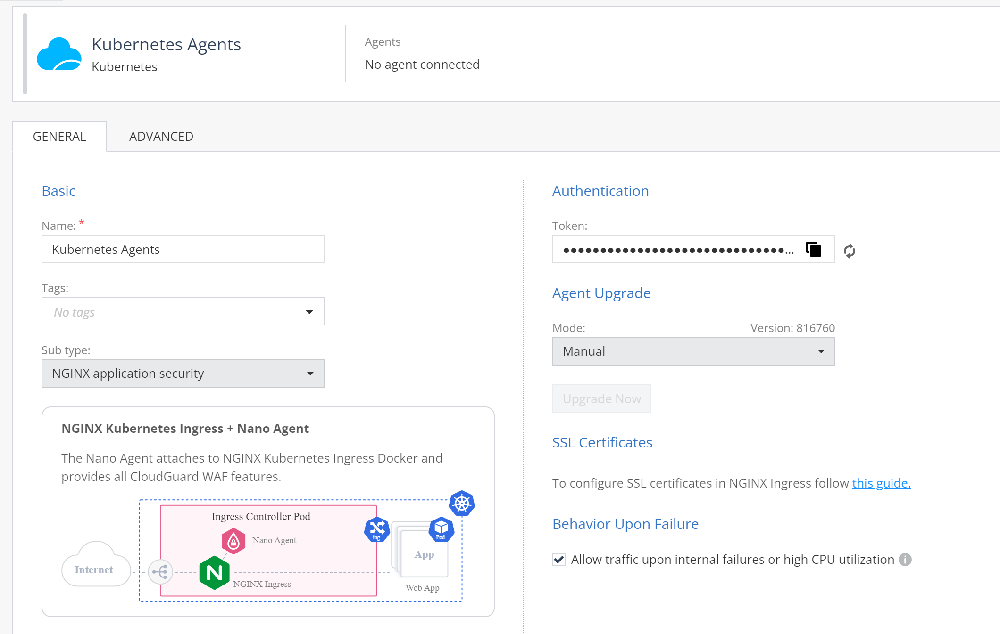
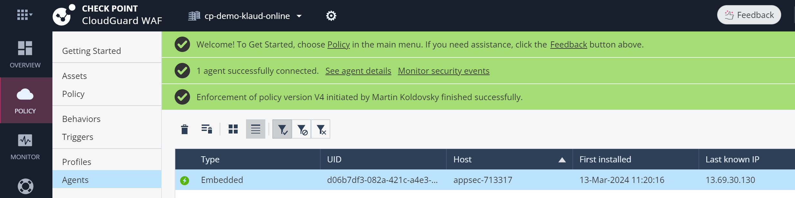

# AppSec Ingress demo on Azure VM with MicroK8s / Ubuntu 20.04


## Goal

What will you get:

* Azure VM with Ubuntu 20.04
* MicroK8s installed enabling easy deployment
* AppSec Ingress installed and configured
* Cert manager for easy HTTPS setup
* Demo application accessible via HTTP and HTTPS

## Prerequisites

* Azure subscription with administrative access
* [Azure Shell](https://shell.azure.com/) access
* [Infinity Portal](https://portal.azure.com/) access
* CloudGuard WAF application tenant enabled

## Step 1: Get VM with MicroK8s easily

```shell
# start in Azure Shell bash terminal 
#   at https://shell.azure.com/

# temporary folder in home
mkdir -p $HOME/$(mktemp -d); cd $_

# get Standard_DS2_v2 VM with Ubuntu LTS and MicroK8s ready at one command
. <(curl -s https://raw.githubusercontent.com/mkol5222/appsec-chart/main/setup-vm.sh)

# once ready, connect to VM using SSH with provided command
sshvm
```

Result:
* VM and all resources in new resource group appsec-<RANDOMID>-rg
* SSH access to VM with MicroK8s installed


## Step 2: Making cluster ready for installation

Provided VM has Microk8s addon ingress that we are about to replace. Lets disable it:

```shell
microk8s disable ingress

# cert-manager is installed for you, lets add LetsEncrypt cluster issuer

# e-mail used for LetsEncrypt
export MYEMAIL=someone@somewhere.net

helm install letsencrypt https://github.com/mkol5222/appsec-chart/releases/download/certs-0.1.0/certs-0.1.0.tgz --set letsencrypt.email=$MYEMAIL
```

## Step 3: WAF management confifuration

Login to [Infinity Portal](https://portal.checkpoint.com/) and choose CloudGuard WAF management application.

Note: You can also [register](https://portal.checkpoint.com/register/) new tenant and start [CloudGuard WAF](https://portal.checkpoint.com/dashboard/get-started/appsec) evaluation tenant.

Lets progress with the [wizard](https://portal.checkpoint.com/dashboard/appsec#/waf-policy/getting-started) to create web application asset and deployment profile. Start under *New Asset* with new *Web Application* option:

We are publishing application http://ip.iol.cz (running on IP **194.228.41.73**) under demo domain https://ip-iol-cz.klaud.online with follwing inputs:

Name: ip-iol-cz

Users will access the application at these URLs: 
  * http://ip-iol-cz.klaud.online
  * https://ip-iol-cz.klaud.online

Ingress will reach the application in this URL: http://194.228.41.73



Practices: we may use PREVENT in demo, but in production we would start in DETECT mode.

Platform: Kubernetes / NGINX

Learning: accept defaults

Certificates: accept defauls

Summary: Publish & Enforce, Deploy agent for Kubernetes Ingress

Will open Kubernetes profile screen:

Agent Upgrade Mode: Manual

Copy Authentication Token for next step.

Publish and Enforce again to save changes.




## Step 4: Install AppSec Ingress

We have got Kubernetes Ingress deployment profile token from previous step. Now we can use it to install AppSec Ingress using helm.

```shell
# autnetication token from previous step
export CPTOKEN=cp-06bc...

# remember 'microk8s disable ingress' from above

# install appsec ingress with helm:
wget https://downloads.openappsec.io/packages/helm-charts/nginx-ingress/open-appsec-k8s-nginx-ingress-latest.tgz

# remember to set CPTOKEN above!
helm install appsec open-appsec-k8s-nginx-ingress-latest.tgz \
--set controller.appsec.mode=managed --set appsec.agentToken=$CPTOKEN \
--set appsec.image.registry="" \
--set appsec.image.repository=checkpoint \
--set appsec.image.image=infinity-next-nano-agent \
--set appsec.image.tag=831851 \
--set controller.hostNetwork=true \
--set controller.ingressClass=public \
--set controller.ingressClassResource.name=public \
--set controller.ingressClassResource.controllerValue="k8s.io/public" \
--set appsec.persistence.enabled=false \
--set controller.service.externalTrafficPolicy=Local \
-n appsec --create-namespace

# now appsec ingress is deployed to NS appsec - wait once it is ready
kubectl get po -n appsec --watch
```

Management confirms installed agent under Policy / Agents:



## Step 5: DNS configuration

We need to configure DNS for our domain ip-iol-cz.klaud.online to point to our VM public IP address. There is `verify-dns` tool included for you.

```shell
# get public IP of VM and compare with current DNS
APPSEC_HOSTNAME=ip-iol-cz.klaud.online verify-dns

# returned:
#   DNS record points to ***wrong*** IP: 194.228.41.73, but it should be 13.69.30.130
#   FAILED: please setup DNS record for ip-iol-cz.klaud.online

# most probably record is missing, lets add it

# and retry
APPSEC_HOSTNAME=ip-iol-cz.klaud.online verify-dns

# returned:
#   Checking that DNS recort for ip-iol-cz.klaud.online points to 13.69.30.130
#   SUCCESS: DNS points to this VM.
```

## Step 6: Publish application via Ingress

```shell

# both internal services and external URL may be published
#   we will use external URL for demo: http://ip.iol.cz

cat << EOF | kubectl apply -f -
apiVersion: v1
kind: Service
metadata:
  name: ip-iol-cz
spec:
  type: ExternalName
  externalName: ip.iol.cz
EOF

# create ingress for the service
#  exposing it under host ip-iol-cz.klaud.online
#  both HTTP and HTTPS
#  with LetsEncrypt certificate

microk8s kubectl apply -f - <<EOF
apiVersion: networking.k8s.io/v1
kind: Ingress
metadata:
 name: ip-iol-cz
 annotations:
   cert-manager.io/cluster-issuer: lets-encrypt
spec:
  ingressClassName: public	
  tls:
  - hosts:
    - ip-iol-cz.klaud.online
    secretName: ip-iol-cz-ingress-tls  
  rules:
  - host: ip-iol-cz.klaud.online
    http:
      paths:
      - path: /
        pathType: Prefix
        backend:
          service:
            name: ip-iol-cz
            port:
              number: 80
EOF

# wait for certificate to be ready
kubectl get certificate -n default --watch

# if all went good, our site is now accessible with valid HTTPS certificate
#  http://ip-iol-cz.klaud.online
```

Result:
* website accessible via HTTP and HTTPS at e.g. http://ip-iol-cz.klaud.online
* some incidents to try:
    * https://ip-iol-cz.klaud.online/?q=/etc/passwd
    * https://ip-iol-cz.klaud.online/?q=UNION+1=1


## Bonus: One more application

Notice: backend is approached via HTTPS and Host header to backend server set to match the service

```shell
cat << EOF | kubectl apply -f -
apiVersion: v1
kind: Service
metadata:
  name: httpbin
spec:
  type: ExternalName
  externalName: httpbin.org
EOF

microk8s kubectl apply -f - <<EOF
apiVersion: networking.k8s.io/v1
kind: Ingress
metadata:
name: httpbin
annotations:
   cert-manager.io/cluster-issuer: lets-encrypt
   nginx.ingress.kubernetes.io/backend-protocol: "HTTPS"
   nginx.ingress.kubernetes.io/upstream-vhost: "httpbin.org"
spec:
  ingressClassName: public  
  tls:
  - hosts:
    - httpbin.klaud.online
    secretName: httpbin-ingress-tls  
  rules:
  - host: httpbin.klaud.online
    http:
      paths:
      - path: /
        pathType: Prefix
        backend:
          service:
            name: httpbin
            port:
              number: 443
EOF
```