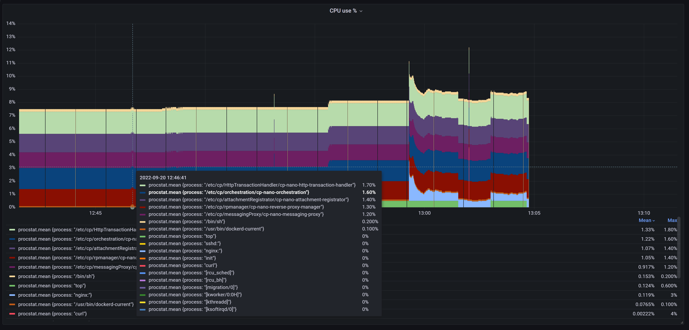

# Monitoring GaiaOS per process in Grafana without external tools

Sometimes you would like to obtain visibility on per-process level how your gateway's resources are utilized and may be identify extremes and trends that can be later correlated to external conditions.

Think about top N processes sorted by current CPU utilization.
```
[Expert@appsecgw:0]# ps --sort=-pcpu aux | head -n 16
USER       PID %CPU %MEM    VSZ   RSS TTY      STAT START   TIME COMMAND
admin    26532  1.8  2.0 173700 142556 ?       S    09:17   4:17 /etc/cp/HttpTransactionHandler/cp-nano-http-transaction-handler --filesystem_path=/etc/cp --log_files_path=/var/log --family=cce51fd17dd3 --id=1
admin    26577  1.8  2.0 173788 142736 ?       S    09:17   4:16 /etc/cp/HttpTransactionHandler/cp-nano-http-transaction-handler --filesystem_path=/etc/cp --log_files_path=/var/log --family=cce51fd17dd3 --id=2
admin     2306  1.6  0.1 112980 12960 ?        S    08:27   4:32 /etc/cp/orchestration/cp-nano-orchestration --orchestration-mode=online_mode --filesystem_path=/etc/cp --log_files_path=/var/log
admin     2350  1.4  0.1  35904 10948 ?        S    08:27   4:02 /etc/cp/attachmentRegistrator/cp-nano-attachment-registrator --filesystem_path=/etc/cp --log_files_path=/var/log
admin    11895  1.4  0.1  37056 11728 ?        S    08:33   3:49 /etc/cp/rpmanager/cp-nano-reverse-proxy-manager --filesystem_path=/etc/cp --log_files_path=/var/log
admin     2320  1.2  0.1  36768 11148 ?        S    08:27   3:33 /etc/cp/messagingProxy/cp-nano-messaging-proxy --filesystem_path=/etc/cp --log_files_path=/var/log
100      30683  0.8  0.0   9424  3204 ?        S    12:59   0:03 nginx: worker 
...
```

But this is just single snapshot of one exact moment in live of your gateway. Processes are constantly created, terminated, some run just shortly and extremes are better seen in visual way. Wouldn't it be nice to see continuous CPU utilization per process similar to chart below?



Would it be difficult to collect relevant data without need for additional utilities to be installed on gateway? May be store it to file that is easy to collect, but also later easy to store to time series database like InfluxDB and display in Grafana dashboard chart.

## InfluxDB line protocol

Time series databases are designed to store continuous measurements identified by *timestamp* and *tags*

Measurement of **weather** might have multiple *fields* like **temperature** measured in multiple **locations** (*tag* spefifying specific *measurement* context). Measurements happen in intervals and are filed with specific moment *timestamp*

```
weather,location=us-midwest temperature=82 1465839830100400200
  |    -------------------- --------------  |
  |             |             |             |
  |             |             |             |
+-----------+--------+-+---------+-+---------+
|measurement|,tag_set| |field_set| |timestamp|
+-----------+--------+-+---------+-+---------+
```

More in [InfluxDB line protocol tutorial](https://docs.influxdata.com/influxdb/v1.8/write_protocols/line_protocol_tutorial/)

*Line protocol* format seems very relevant way to store our continuous CPU utilization measurements and will enable us easily to import it to InfluxDB as needed.

Have a look above at `ps aux` output columns. We need to parse this data into Line Protocol output.
First we name our *measurement* e.g. **procstat** and every time we are collecting CPU usage per each **process** (which becomes *tag* together with unique process **pid**). 
More than one parameter of process can be included as *field* on single line - **cpu_pct** and **mem_pct** document % of CPU and memory by certain process.
Last element on line is *timestamp* - it is epoch time (since January 1st 1970) measured in milliseconds since that day.

```
[Expert@appsecgw:0]# tail -5 /var/log/bettertop/procstat.line
procstat,process="init",pid="1" cpu_pct=0.0,mem_pct=0.0 1663671885000
procstat,process="[kthreadd]",pid="2" cpu_pct=0.0,mem_pct=0.0 1663671885000
procstat,process="[ksoftirqd/0]",pid="3" cpu_pct=0.0,mem_pct=0.0 1663671885000
procstat,process="[kworker/0:0H]",pid="5" cpu_pct=0.0,mem_pct=0.0 1663671885000
procstat,process="[migration/0]",pid="7" cpu_pct=0.0,mem_pct=0.0 1663671885000
```

## Processing from ps to Line Protocol

We have well defined source of data - command `ps aux` and well defined format of output, so we would need smart Unix tools to help us with processing data and save it on disk.

To collect relevant data, we will sort processes by CPU utilization in descending order `--sort=-pcpu` and collect only N top processes using `head -n 16`
```
[Expert@appsecgw:0]# ps --sort=-pcpu aux | head -n 16
USER       PID %CPU %MEM    VSZ   RSS TTY      STAT START   TIME COMMAND
admin    26532  1.8  2.0 173700 142556 ?       S    09:17   4:17 /etc/cp/HttpTransactionHandler/cp-nano-http-transaction-handler --filesystem_path=/etc/cp --log_files_path=/var/log --family=cce51fd17dd3 --id=1
admin    26577  1.8  2.0 173788 142736 ?       S    09:17   4:16 /etc/cp/HttpTransactionHandler/cp-nano-http-transaction-handler --filesystem_path=/etc/cp --log_files_path=/var/log --family=cce51fd17dd3 --id=2
admin     2306  1.6  0.1 112980 12960 ?        S    08:27   4:32 /etc/cp/orchestration/cp-nano-orchestration --orchestration-mode=online_mode --filesystem_path=/etc/cp --log_files_path=/var/log
```

We also need epoch time in milliseconds. Date format string is producing timestamp in seconds, so we simply turn it ms by adding 3 zeros at the end.
```
[Expert@appsecgw:0]# date +%s000; date
1663673612000
Tue Sep 20 13:33:32 CEST 2022
```

[AWK](https://linux.die.net/man/1/awk) makes it easy to access specific columns in `ps aux` output. We need to skip output header and focus only on data lines using `NR>1`
```
[Expert@appsecgw:0]# ps --sort=-pcpu aux | head -n 16  | awk -v ts="$TS" 'NR > 1 { print "procstat,process=\""$11"\",pid=\""$2"\" cpu_pct="$3",mem_pct="$4" "ts }' | head -3
procstat,process="/etc/cp/HttpTransactionHandler/cp-nano-http-transaction-handler",pid="26532" cpu_pct=1.8,mem_pct=2.0
procstat,process="/etc/cp/HttpTransactionHandler/cp-nano-http-transaction-handler",pid="26577" cpu_pct=1.8,mem_pct=2.0
procstat,process="/etc/cp/orchestration/cp-nano-orchestration",pid="2306" cpu_pct=1.6,mem_pct=0.1
```

## Data collection script

Lets put data collection logic into biggest partition of GaiaOS disk:
```
mkdir /var/log/bettertop
```

Full script logic for continuous data collection
```
#!/bin/bash
while true; do
  TS=$(date +%s000)
  ps --sort=-pcpu aux | head -n 16  | awk -v ts="$TS" 'NR > 1 { print "procstat,process=\""$11"\",pid=\""$2"\" cpu_pct="$3",mem_pct="$4" "ts }' >> /var/log/bettertop/procstat.line
  sleep 1
done
```

Store it as `/var/log/bettertop/collect.sh` and run
```
vi /var/log/bettertop/collect.sh
chmod +z /var/log/bettertop/collect.sh
/var/log/bettertop/collect.sh
```

Once you monitor as long as needed, use CTRL-C and collect `/var/log/bettertop/procstat.line`

We will discuss how to build Grafana and InfluxDB services later. Here is example how to send data to the server. Assuming *my.grafana.local* is your real InfluxDB server hostname.

```
[Expert@appsecgw:0]# cat /var/log/bettertop/upload.sh
#!/bin/bash

cat /var/log/bettertop/procstat.line | curl -i -X POST "http://my.grafana.local:8086/write?db=procstats&precision=ms" --data-binary @-
```

## Reference

My implementation is based on [article](https://devconnected.com/monitoring-linux-processes-using-prometheus-and-grafana/) by [SCHKN](https://devconnected.com/author/schkn/)