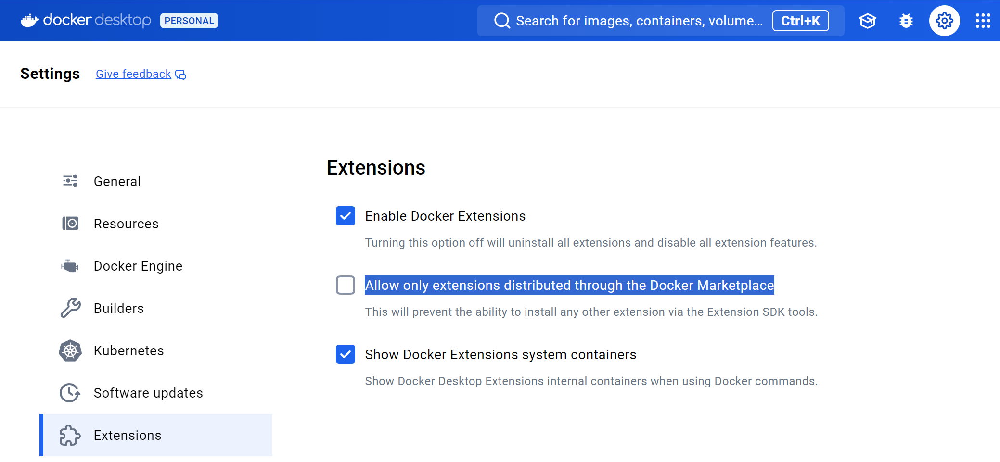
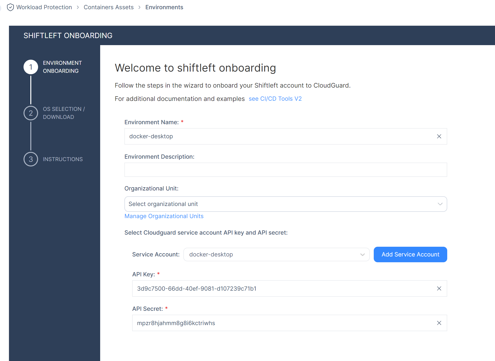
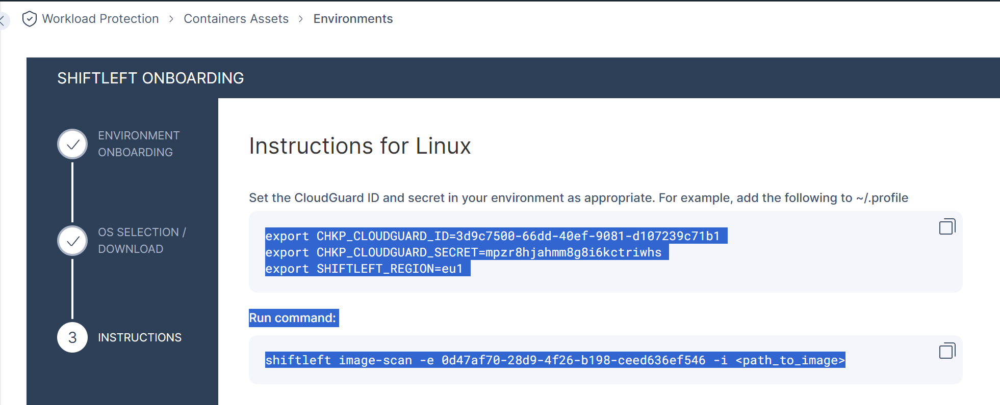
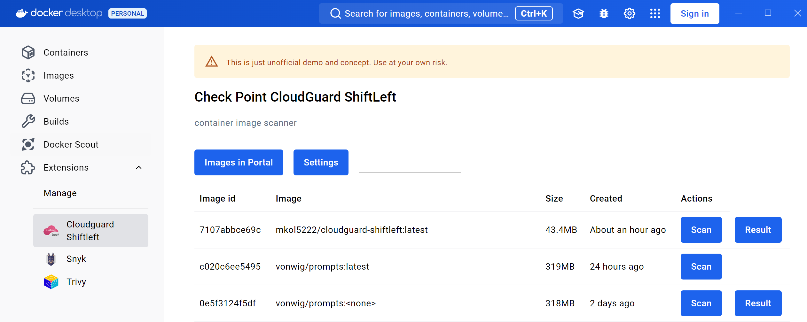
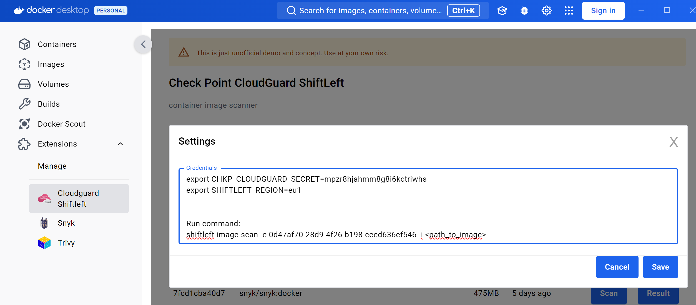
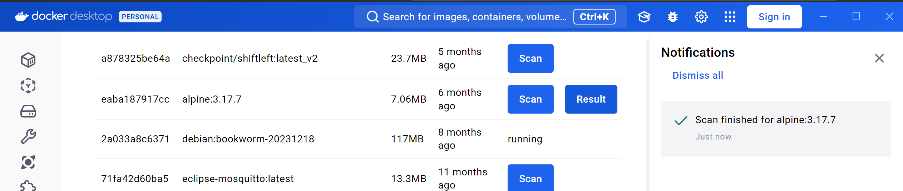
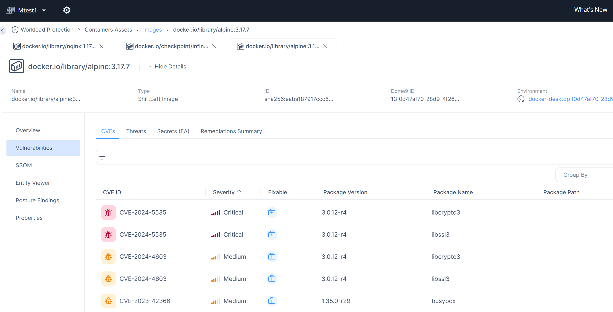

# How to evaluate experimental Docker Desktop extension for CloudGuard Shiftleft v2 scanner

### Limitations
* very early preview and hoppy project - use at your own risk
* might not work on MacOS with arm64 CPUs due to [scanner container image](https://hub.docker.com/layers/checkpoint/shiftleft/latest_v2/images/sha256-c3e1a53c57abc9b9a67577fa33d763dd93b9cc34e9230f5bafa8f6c5272839c0?context=explore) platform support (amd64 only)
* not yet listed in Docker Marketplace - installed with Docker CLI with "Allow only extensions distributed through the Docker Marketplace" setting disabled


### Prerequisites
* latest [Docker Desktop](https://www.docker.com/products/docker-desktop/) installed
* Check Point Infinity Portal [account](https://portal.checkpoint.com/register/) with CloudGuard CNAPP activad

### Installation

1. Pull extension from [Docker Hub](https://hub.docker.com/r/mkol5222/cloudguard-shiftleft/tags) using

```shell
docker pull mkol5222/cloudguard-shiftleft:latest
```

```
latest: Pulling from mkol5222/cloudguard-shiftleft
46b060cc2620: Already exists
7983851c34d6: Pull complete
...
b5f4818b5ebe: Pull complete
Digest: sha256:29501059d48bd09d5775bb43b9a0be68d5ff8afecedd7d0528f91b421dd699e5
Status: Downloaded newer image for mkol5222/cloudguard-shiftleft:latest
docker.io/mkol5222/cloudguard-shiftleft:latest
```

2. Make sure that unlisted Docker Desktop extensions are allowed in Docker Desktop Dashboard settings under Settings/Extensions. Checkbox should be unchecked.



3. Install extension with

```shell
docker extension install mkol5222/cloudguard-shiftleft:latest
```

```
Extensions can install binaries, invoke commands, access files on your machine and connect to remote URLs.
Are you sure you want to continue? [y/N] y
Extracting metadata and files for the extension "mkol5222/cloudguard-shiftleft:latest"
Installing service in Desktop VM...
Setting additional compose attributes
Installing Desktop extension UI for tab "Cloudguard Shiftleft"...
Extension UI tab "Cloudguard Shiftleft" added.
Starting service in Desktop VM......
Service in Desktop VM started
Extension "CloudGuard ShiftLeft" installed successfully
```

4. Login to CloudGuard CNAPP in Check Point Infinity Portal and on-board new Shiftleft environment on URL 
https://portal.checkpoint.com/dashboard/cloudguard#/workload/cloud-add/shiftleft

Client `shiftleft` binary requires following data to work: API key ID (consider it username), API key secret (password), region (e.g. eu1) and shiftleft environment ID in CloudGuard CNAPP. It is result of on-boarding wizard.



On next step: You may choose any binary and ignore download instructions.

Final step has valuable instruction for your notes or password manager:

Mark instructions as in picture and CTRL-C to copy to clipboard and your password manager.


Result looks like text below. This is what you later paste to text box in extensions Settings dialog,
Notice API key ID and secret, region and env id in command under option -e.
Leave text as it is, extension knows how to read it.
This API key in documentation was already revoked.

```
export CHKP_CLOUDGUARD_ID=3d9c7500-66dd-40ef-9081-d107239c71b1
export CHKP_CLOUDGUARD_SECRET=mpzr8hjahmm8g8i6kctriwhs
export SHIFTLEFT_REGION=eu1


Run command:
shiftleft image-scan -e 0d47af70-28d9-4f26-b198-ceed636ef546 -i <path_to_image>
```

5. Configure Docker Extension with Shiftleft credentials:

Under Docker Desktop UI in Extensions section / CloudGuard ShiftLeft - click settings


Paste credentials from your notes in format as above and Save it.


Now you are ready for first scan.

6. Choose one of images and start scan with Scan button.

Once scan is finished notification comes and button Result leads to Infinity Portal asset with all details:



Report in portal:




### Troubleshooting

You may monitor UI console of extension after following comment and revisiting UI. Browser Developer Tools window will open next to Docker Desktop UI.

```shell
docker extension dev debug mkol5222/cloudguard-shiftleft:latest
```

```
Debug mode for the extension "mkol5222/cloudguard-shiftleft:latest" was enabled
```

### Cleanup

```
docker extension remove mkol5222/cloudguard-shiftleft:latest
docker rmi mkol5222/cloudguard-shiftleft:latest
```