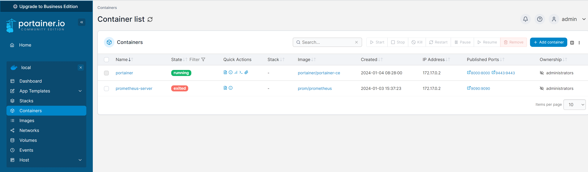

# Portainer - missing Docker GUI

## What is Portainer

Portainer is a lightweight management UI which allows you to easily manage your different Docker environments (Docker hosts or Swarm clusters). Portainer is meant to be as simple to deploy as it is to use. It consists of a single container that can run on any Docker engine (can be deployed as Linux container or a Windows native container, supports other platforms too). Portainer allows you to manage all your Docker resources (containers, images, volumes, networks and more)

## Install Portainer

```shell
# create portainer-data volume
docker volume create portainer-data

# run portainer container
docker run -d -p 8000:8000 -p 9443:9443 --name=portainer --restart=always -v /var/run/docker.sock:/var/run/docker.sock -v portainer-data:/data portainer/portainer-ce

# open Portainer in browser
# https://localhost:9443
```

### Portainer - missing Docker GUI

Once you create new admin user and choose local Docker environment you will see the Portainer dashboard with ability to manage all your Docker resources (containers, images, volumes, networks and more).



## References

- [Portainer](https://www.portainer.io/)
- [Portainer on Docker Hub](https://hub.docker.com/r/portainer/portainer)
- [Install Portainer](https://docs.portainer.io/start/install-ce/server/docker/linux)