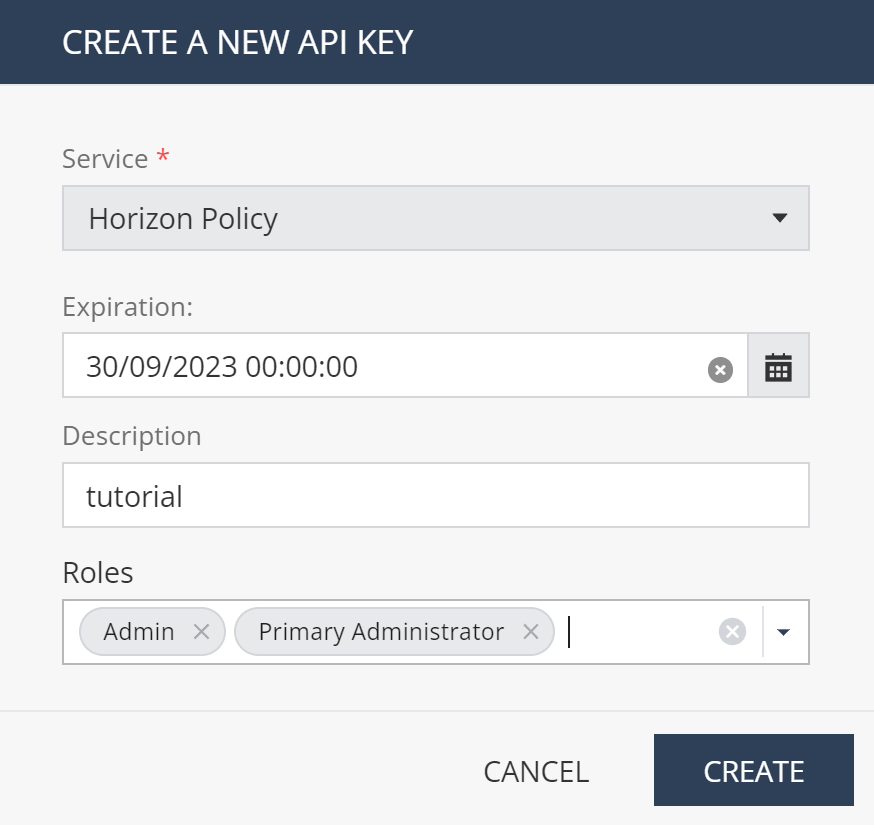
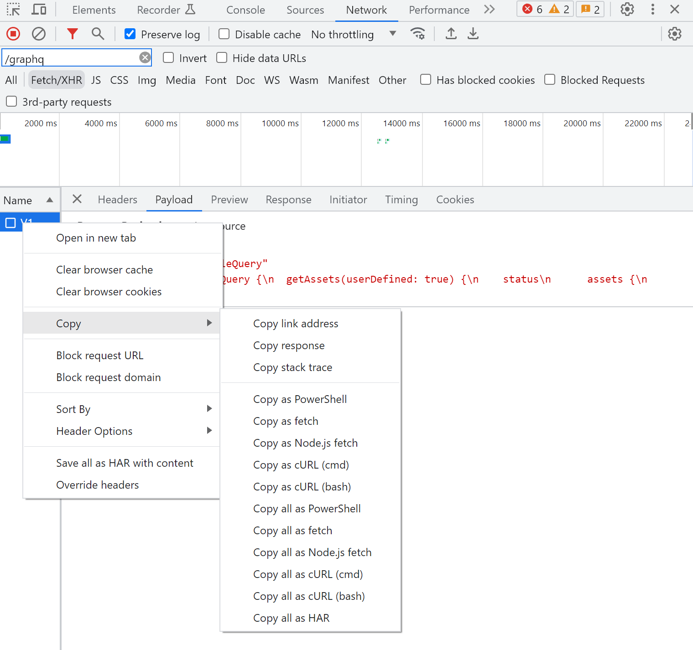

# Journey from browser to GraphQL API client

This articte describes how to develop GraphQL API client 
based on analysis of GraphQL requests captured in web browser.
We are choosing Check Point CloudGuard AppSec magement API as an example.

We will be developing script that is able to list and delete
AppSec assets with certain name prefix.

There is however one more thing to address: AppSec API requires authentication token to be passed in HTTP header,
so we will also demonstrate how to obtain the token that is requested based on API key first.


## Useful resources
* AppSec API [playground](https://portal.checkpoint.com/dashboard/policy#/support/api/) is part of management portal and guides you through GrapgQL schema
* High level AppSec [Management API documentation](https://appsec-doc.inext.checkpoint.com/references/management-api) is part of AppSec documentation and includes section about Authentication


## AppSec API authentication

Authentication token is obtained based on API keys issued under Check Point Infinity Portal tenant's Global settings / [API Keys section](https://portal.checkpoint.com/dashboard/settings/api-keys).

### Obtaining API keys
Choose Service: Horizon Policy, relevant expiration date and Admin/Primary Admin roles.



Note client ID, secret (shown only once) and authentication URL to your password manager for later use.


### Testing authentication in VS Code REST Client

[REST Client](https://marketplace.visualstudio.com/items?itemName=humao.rest-client) is extension for [VS Code](https://code.visualstudio.com/) similar to [Postman](https://www.postman.com/), that allows to send HTTP requests from VS Code. Its main benefit is that you can save requests in text files and share them with others. You may also call this approach *API (requests) as code*.

We will use REST Client to test authentication and obtain authentication token. You may store this as file with extenstion `http` and open it in VS Code with REST Client extension installed.

```http
```http
### 1. Obtain authentication token
#
# @name login

# you may use environment variables to store sensitive data
@clientId = {{$processEnv appsecClientId}}
@accessKey = {{$processEnv appsecAccessKey}}

# to avoid hardocoding them similar to
@clientId = 188USEYOUROWN39db425947645abe6a2
@accessKey = a1aba1USEYOUROWN795b4a0


POST https://cloudinfra-gw.portal.checkpoint.com/auth/external
content-type: application/json

{"clientId":"{{clientId}}" ,"accessKey":"{{accessKey}}" }

### 2. Use authentication token to access AppSec API
#
# now we access token in response from login request
@authToken = {{login.response.body.data.token}}

# we will simply copy example query from API playground
# notice X-REQUEST-TYPE: GraphQL is pesudo-header
# that incidates to REST Client that this is GraphQL request
# and makes it easier to write GraphQL queries
# without encoding them into body manually

# @name getAssets
POST https://cloudinfra-gw.portal.checkpoint.com/app/i2/graphql/V1
authorization: Bearer {{authToken}}
content-type: application/json
X-REQUEST-TYPE: GraphQL

query ExampleQuery {
  getAssets {
    status
      assets {
        id
        name
      }
  }
}
```

Summary: If you took opportunity to try .http file provided in VSCODE,
you already know how to authenticate to AppSec API and obtain authentication token.
You also tried your first GraphQL query inspired by one present in API playground.
REST Client made it easier to write GraphQL query by encoding it into body for you.
We will discuss how GrahpQL queries are encoded into HTTP requests later in this article.


## Capturing GraphQL API requests in browser

Chrome browser Developer Tools Network tab allows us to capture HTTP requests for further analysis. We will use it to capture GraphQL requests sent to AppSec API. They can be replayed using `curl` on Linux or using `Powershell` with very little effort thanks to "copy (request) as"  functionality.

The session can also be stored to *HAR file* and subjet to automated analysis with tools like Powershell, because HAR file is easy to review as it is simple JSON format.
Powershell might help us to focus on GraphQL requests only and analyze API calls from live sessions captured from web browser based application web UI.



### Capture list assets request in your browser

I have opened AppSec Management [API Explorer](https://portal.checkpoint.com/dashboard/policy#/support/api/) and modified query to list *only user defined assets* to reduce number of results.


```graphql

query ExampleQuery {
  getAssets(userDefined: true) {
    status
      assets {
        id
        name
      }
  }
}
```

### HAR analysis

* after Copy all as HAR, HAR in clipboard

```powershell
# working folder
mkdir $env:TEMP/har; cd $env:TEMP/har
# save clipboard to file
Get-Clipboard | Set-Conent -Path .\a.har
# HAR is JSON, so we can use ConvertFrom-Json
$har = Get-Content .\a.har | ConvertFrom-Json
$har
# series of requests
$har.log.entries
# GraphQL request is POST to https://cloudinfra-gw.portal.checkpoint.com/app/i2/graphql/V1
$graphqlRequests = $har.log.entries | Where-Object { $_.request.url -match 'graphql' -and $_.request.method -eq 'POST' }
$graphqlRequests
# lets focus on operationName and what is query behind it
$grahqlPayloads = $graphqlRequests.request.postData.text | ConvertFrom-Json
$grahqlPayloads | fl *
# we can filter where operationName is ExampleQuery
$grahqlPayloads | ? { $_.operationName -eq 'ExampleQuery' } | fl *
```

### more HAR analysis

* lets extend our HAR entries with GraphQL operation name for easier filtering
```powershell
# starting from $graphqlRequests above
$graphqlRequests = $graphqlRequests | % { $graphqlPayload = $_.request.postData.text | ConvertFrom-Json ; $_ | Add-Member -NotePropertyName operationName -NotePropertyValue  $graphqlPayload.operationName -PassThru -Force } | fl *
# filter by operation
$graphqlRequests | ? { $_.operationName -eq 'ExampleQuery' } | fl *

# and look at response
$graphqlRequests | ? { $_.operationName -eq 'ExampleQuery' } | % { $_.response.content.text | ConvertFrom-Json } | fl *

# most probably "Copy as HAR" did not include response body, but if you save HAR in Dev Tools it will. Retry with saved HAR fike ;-)

$responseBodies = $graphqlRequests | ? { $_.operationName -eq 'ExampleQuery' } | % { $_.response.content.text } 

$responseBodies | % { $_ | ConvertFrom-Json } | select -ExpandProperty data | fl *

# go deeper
$responseBodies | % { $_ | ConvertFrom-Json } | select -ExpandProperty data | select -ExpandProperty getAssets | fl *
# and see asset list
$responseBodies | % { $_ | ConvertFrom-Json } | select -ExpandProperty data | select -ExpandProperty getAssets | select -ExpandProperty assets | fl *

# save them from last call to var and filter
$assets = $responseBodies | select -last 1 | % { $_ | ConvertFrom-Json } | select -ExpandProperty data | select -ExpandProperty getAssets | select -ExpandProperty assets
$assets

$assets | ? { $_.name -like 'WebAsset-*' } | ft
```

Summary: we were able to identify GraphQL requests in HAR file and filter them by operation name. We were also able to extract GraphQL query from request body and response from response body. We were able to filter assets by name and list them in table.

This seems to be great start for deleting these assets. 

### Delete assets using API call

We will create request in AppSec API playground and copy it in Chrome Developer Tools as curl to create REST Client .http file. Later we turn it into Powershell script.

```graphql
mutation DeleteAsset  {
  deleteAsset(id: "9cc24a86-ac91-cdf9-baa7-20f6eb42dc95")
}
```

This deserves to be more generic and turn hardcoded ID into variable.

```graphql
# request - mutation has parameter $assetId of matching data type
mutation DeleteAsset($assetId: String!) {
    deleteAsset(id: $assetId)
}

# and variable value is defined in separate Query Variables secton
{
    "assetId": "9cc24a86-ac91-cdf9-baa7-20f6eb42dc95"
}
```

I will play the query, find it in Chrome Dev Tools and Copy as CURL:
(some sensitive headers were removed)

```bash
curl 'https://cloudinfra-gw.portal.checkpoint.com/app/i2//graphql/V1' \
  -H 'content-type: application/json' \
  --data-raw $'{"query":"\\nmutation DeleteAsset($assetId: String\u0021) {\\n    deleteAsset(id: $assetId)\\n}\\n \\n","variables":{"assetId":"0ec3de75-772a-ec13-ab5f-1293efab529e"},"operationName":"DeleteAsset"}' \
  --compressed
```

Notice target URL, content-type header and request body.

We also replace `\\n` with `\n` in our text editor.

This helps us with necessary REST client .http file creation:

```http
POST https://cloudinfra-gw.portal.checkpoint.com/app/i2/graphql/V1
authorization: Bearer {{authToken}}
content-type: application/json

{"query":"\nmutation DeleteAsset($assetId: String\u0021) {\n    deleteAsset(id: $assetId)\n}\n \n","variables":{"assetId":"0ec3de75-772a-ec13-ab5f-1293efab529e"},"operationName":"DeleteAsset"}
```

Body is valid JSON containing GraphQL query and variables, so we may use bash environment to render it more readable for making REST Client representation easier to read:
  
```bash
echo $'{"query":"\\nmutation DeleteAsset($assetId: String\u0021) {\\n    deleteAsset(id: $assetId)\\n}\\n \\n","variables":{"assetId":"0ec3de75-772a-ec13-ab5f-1293efab529e"},"operationName":"DeleteAsset"}' | jq .
```

Will output
```json
{
  "query": "\nmutation DeleteAsset($assetId: String!) {\n    deleteAsset(id: $assetId)\n}\n \n",
  "variables": {
    "assetId": "0ec3de75-772a-ec13-ab5f-1293efab529e"
  },
  "operationName": "DeleteAsset"
}
```

REST Client representation can be rewritten as:

```http
###
#
# 3a. GraphQL asset delete query simplified
#   there are 3 sections delimited by empty line:
#   1. request headers
#   2. GraphaQL query
#   3. query variables

POST https://cloudinfra-gw.portal.checkpoint.com/app/i2/graphql/V1
authorization: Bearer {{authToken}}
content-type: application/json
X-REQUEST-TYPE: GraphQL

mutation DeleteAsset($assetId: String!) {
    deleteAsset(id: $assetId)
}

{"assetId": "0ec3de75-772a-ec13-ab5f-1293efab529e"}

```