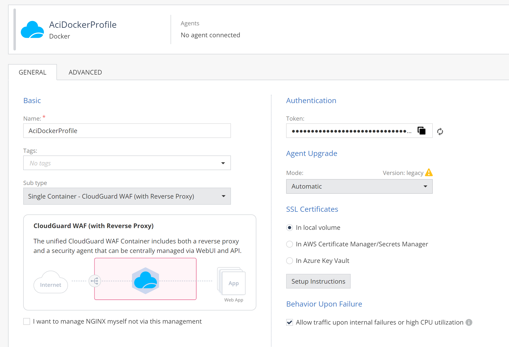
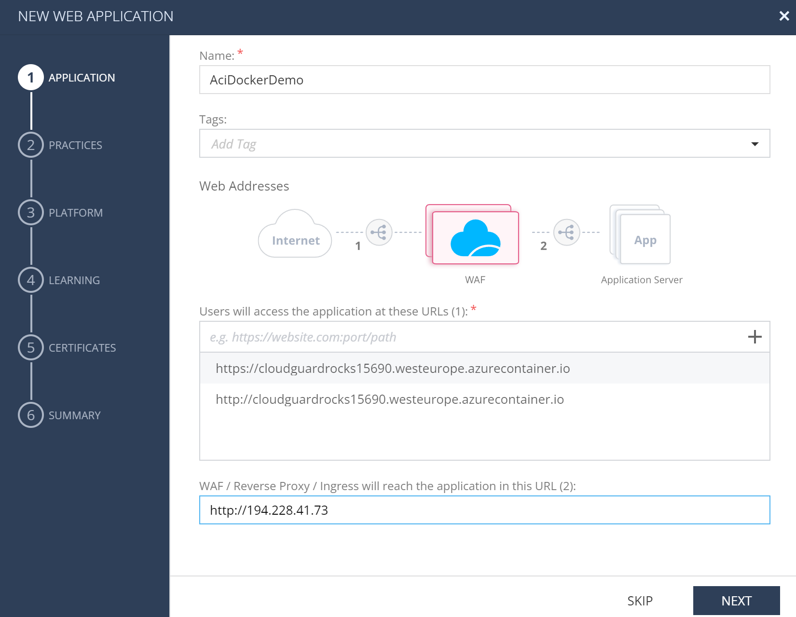
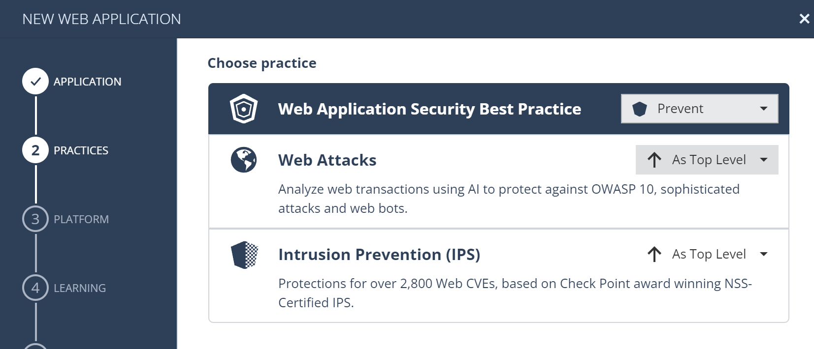
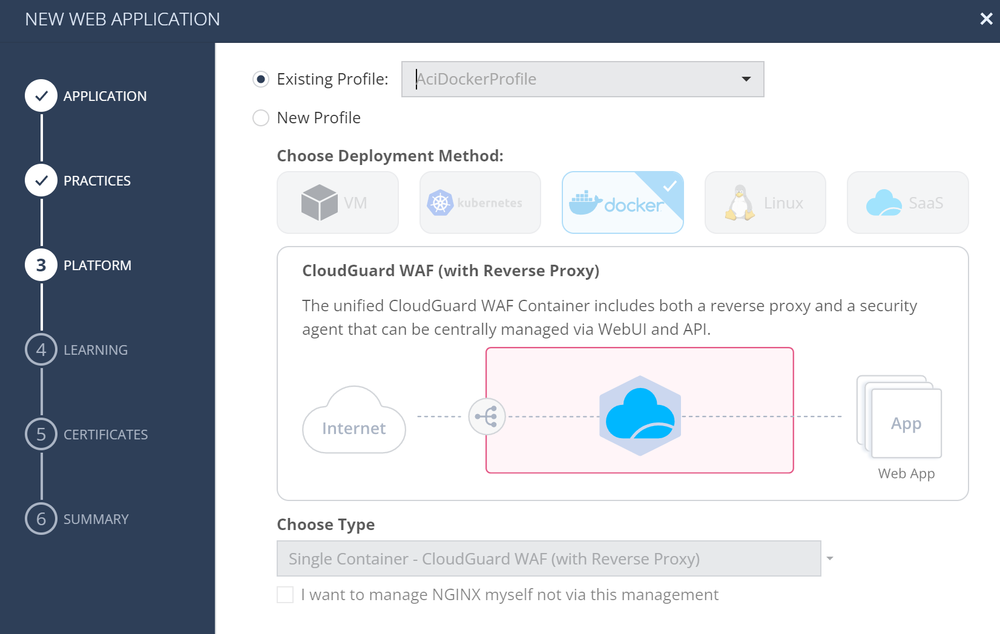

# CloudGuard WAF on Azure ACI (Azure Container Instances)

## Introduction

* CloudGuard WAF is available as a containerized solution combining WAF security agent with reverse proxy
* ACI provides a way to run containers on Azure without managing the underlying infrastructure
* ACI seems to be good alternative to full GaiaOS based VM or more compelex but flexible Kubernetes based deployment
* This document provides step-by-step guide to deploy CloudGuard WAF on Azure ACI
* We have decided to use Azure CLI for this deployment for better understanding of the process
* Commands can be run from Azure Cloud Shell or from local machine with Azure CLI installed
* we suggest Ubuntu based Github Codespace with Azure CLI installed for better experience
* we assume Ubuntu Limux with Docker installed as work environment for this scenario

## Getting started

```shell
# make sure you are logged to your Azure subscription with Owner/Contributor role
az account list -o table

# if not yet logged-in
az login

# consider temporary folder
cd $(mktemp -d)

# initial inputs
RG=rg-waf-aci
LOCATION=westeurope
NAME=cloudguardrocks
SA=$NAME$RANDOM
FILESHARE=certs
DNSLABEL=$NAME$RANDOM

# RG that can be delated at the end of demo
az group create --name $RG --location $LOCATION

# check how running and exposing contaimer can be done
az container create --resource-group $RG --name mycontainer --image mcr.microsoft.com/azuredocs/aci-helloworld --dns-name-label $NAME$RANDOM --ports 80

# see hostname and status
az container show --resource-group $RG --name mycontainer --query "{FQDN:ipAddress.fqdn,ProvisioningState:provisioningState}" --out table

# some logs
az container logs --resource-group $RG --name mycontainer

# look around in container
az container exec --resource-group $RG --name mycontainer --exec-command "ps ax"
# exit once done
az container exec --resource-group $RG --name mycontainer --exec-command "/bin/sh"

# open browser and check the result
H=$(az container show --resource-group $RG --name mycontainer --query ipAddress.fqdn -o tsv)
echo "open http://$H"
curl -vvv "http://$H" 2>&1 | head -30

# delete the container, once bored
az container delete --resource-group $RG --name mycontainer
```

Now we know what kind of animal ACI is, let's move to CloudGuard WAF deployment.

## CloudGuard WAF deployment

Lets create new WAF Docker Profile in Infity Portal and get token to install the container.
Remember to publish and enforce policy before continuing.



Copy toke to clipboard and use it in the next step.

```shell
# modify with yourn real value!
CPTOKEN=cp-7c09369e-142f-40bc-9202-42375b1f3b4175cf9f2a-cb8f-4189-b4b1-213df3c6c4af

# we will copy the container from Docker Hub repository, because of rate limits

# choose registry name
ACRNAME=$NAME$RANDOM
az acr create --resource-group $RG --name  $ACRNAME --sku Standard --admin-enabled true
# check it
az acr show --name $ACRNAME  --output table
# login docker to it
az acr login --name $ACRNAME

# pull and reupload image
docker pull docker.io/checkpoint/cloudguard-appsec-standalone
docker tag docker.io/checkpoint/cloudguard-appsec-standalone $ACRNAME.azurecr.io/cloudguard-appsec-standalone
docker push $ACRNAME.azurecr.io/cloudguard-appsec-standalone

# check it - should see image cloudguard-appsec-standalone there
az acr repository list --name $ACRNAME --output table

# we also want self signed certificate for our domain
APPSECAPP=$DNSLABEL.$LOCATION.azurecontainer.io
openssl req -newkey rsa:2048 -nodes -keyout app.key -x509 -days 365 -addext "subjectAltName = DNS:${APPSECAPP}" -subj "/C=US/CN=${APPSECAPP}" -out app.pem
openssl x509 -text -noout -in app.pem | egrep 'DNS|CN'


# cert has to be stored on file share for the demo - we would suggest KeyVault in production
az storage account create --name $SA --resource-group $RG --location westeurope --sku Standard_LRS
az storage share-rm create --name $FILESHARE --storage-account $SA --resource-group $RG
STORAGE_KEY=$(az storage account keys list --resource-group $RG --account-name $SA --query "[0].value" --output tsv)
echo $STORAGE_KEY
az storage share-rm list --storage-account $SA -o table
# upload certs
az storage file upload --share-name $FILESHARE --source app.pem --path app.pem --account-name $SA
az storage file upload --share-name $FILESHARE --source app.key --path app.key --account-name $SA
# list files
az storage file list --share-name $FILESHARE --account-name $SA --output table

# container registry credentials
ACRU=$(az acr credential show --name $ACRNAME --query "username" --output tsv)
ARCP=$(az acr credential show --name $ACRNAME --query "passwords[0].value" --output tsv)
echo $ACRU $ARCP

# time to create the container
az container create  --resource-group $RG --name waf --image $ACRNAME.azurecr.io/cloudguard-appsec-standalone:latest --dns-name-label $DNSLABEL --ports 80 443 8117 \
--environment-variables CPTOKEN=$CPTOKEN --restart-policy Always --command-line "/cloudguard-appsec-standalone --token $CPTOKEN" \
--registry-username $ACRU --registry-password $ARCP \
--cpu 4 --memory 4 --os-type Linux --ip-address Public --location $LOCATION \
  --azure-file-volume-share-name $FILESHARE \
  --azure-file-volume-account-name $SA \
  --azure-file-volume-account-key $STORAGE_KEY \
  --azure-file-volume-mount-path /etc/certs

# check the status
az container show --resource-group $RG --name waf --query "{FQDN:ipAddress.fqdn,ProvisioningState:provisioningState}" --out table

# container logs
az container logs --resource-group $RG --name waf
```

### Asset

We should have web app asset for container FQDN assigned to *AciDockerProfile*, lets create it and enforce policy:







```shell
# expected fqdn
az container exec --resource-group $RG --name waf --exec-command "cpnano -dp" | grep context
az container exec --resource-group $RG --name waf --exec-command "cpnano -dp" | grep context | grep $DNSLABEL.$LOCATION.azurecontainer.io

az container exec --resource-group $RG --name waf --exec-command "cpnano -dp" | grep context |  grep 443

# policy installed
az container exec --resource-group $RG --name waf --exec-command "cpnano -s"

# certs are present?
az container exec --resource-group $RG --name waf --exec-command "ls -l /etc/certs"
az container exec --resource-group $RG --name waf --exec-command "openssl x509 -text -noout -in /etc/certs/app.pem" | egrep 'DNS|CN'

# expected fqdn

# health check
while ! nc -w 3 -z -v $DNSLABEL.$LOCATION.azurecontainer.io 8117; do echo retrying; sleep 3; done

while true; do curl -m5 -vvv "http://$DNSLABEL.$LOCATION.azurecontainer.io/api/health" 2>&1 | head -30; sleep 5; done

# incident
curl -m5 -vvv "http://$DNSLABEL.$LOCATION.azurecontainer.io/?q=cat+/etc/passwd" 2>&1 | head -30; 

# HTTPS
curl -m5 -k -vvv "https://$DNSLABEL.$LOCATION.azurecontainer.io/?q=cat+/etc/passwd" 2>&1 | head -30;

```

## Cleanup

```shell
# remove waf container
az container delete --resource-group $RG --name waf
# complete cleanup
az group delete --name $RG --yes --no-wait
```
