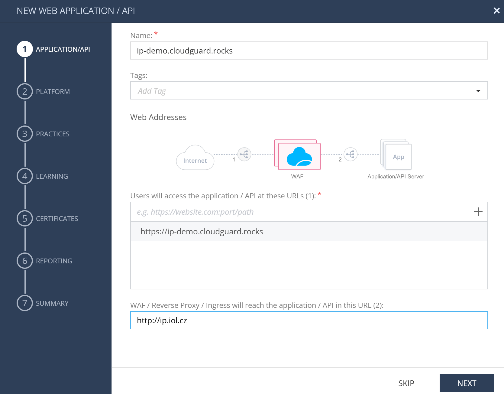
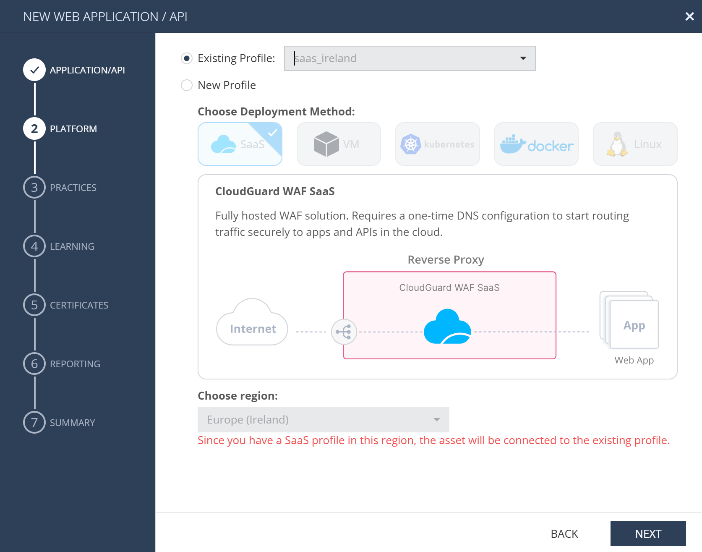
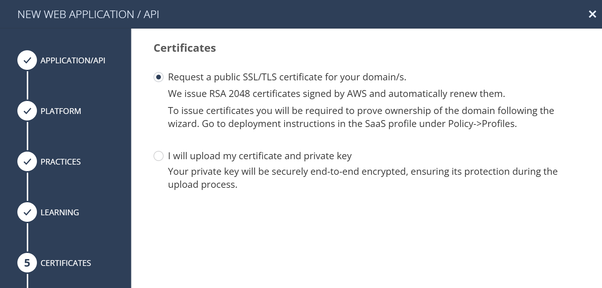
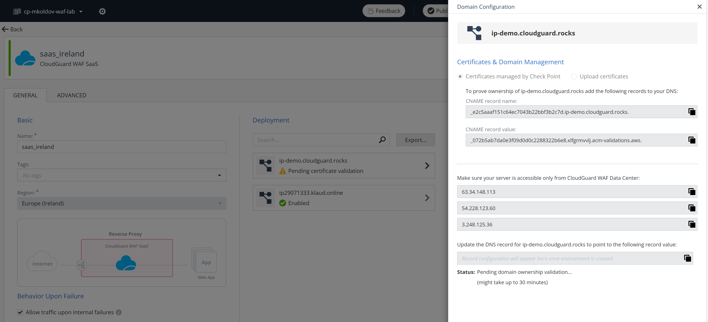
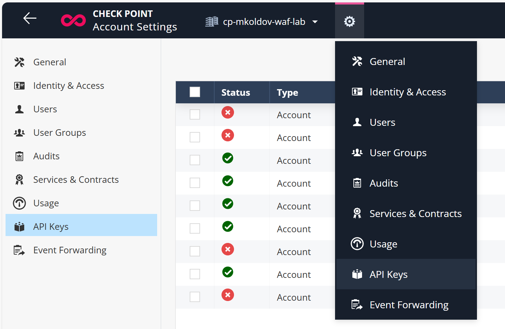

# CloudGuard WAF as a Service - automation of DNS records

### NOTE: This automation project is just an experimental concept, not official Check Point solution.

Check Point [CloudGuard WAF](https://www.checkpoint.com/cloudguard/waf/) as a Service (WAFaaS) provides a simple way to protect your web applications and APIs without the need to manage the underlying infrastructure. This document describes how to automate the DNS records for your WAF service.

## Prerequisites

- Infinity Portal account [registered](https://portal.checkpoint.com/create-account)
- CloudGuard WAF application [activated](https://portal.checkpoint.com/dashboard/appsec/cloudguardwaf#/waf-overview) in your Infinity Portal account
- At least one WAF asset assigned to WAF Profile type `CloudGuard WAF SaaS`

## Step 1: Create a WAF Asset on CloudGuard WAF SaaS Profile

Assume we manage domain `cloudguard.rocks` and want to protect web application `ip-demo.cloudguard.rocks` with CloudGuard WAF SaaS.

Lets create new asset with front-end URL `https://ip-demo.cloudguard.rocks` and back-end URL `http://ip.iol.cz` (this is a public IP address of a web server that we want to protect).


We will deploy this asset to existing profile `saas-ireland` in selected region `Europe (Ireland)`.


Lets request Check Point to manage HTTPS certificate for our domain `ip-demo.cloudguard.rocks` so we can demonstrate validation of domain ownership with DNS records.


Once we finish WAF asset creation wizard, policy is published and enforced and we are presented with WAF as service profile and our domain details.


Process is now pending DNS record creation and validation by Check Point.


## Step 2: API key for WAFaaS DNS record automation

We will demonstrate how to use Terraform module `cloudguard-waf-dns` to access information about WAF DNS records to automate DNS record creation and management with customer specific DNS provider or script.

Data about WAF DNS records are available using CloudGuard WAF API which requires authentication by API key. You can provision your API key in Infinity Portal under `Global Settings` wheel icon -> `API Keys` section.


Create New Account API Key with Service `CloudGuard WAF` and desired expiration date.

API key has two parts called `Client ID` (think username) and `Secret key` (think password). You will need both to authenticate against CloudGuard WAF API in `cloudguard-waf-dns` terraform module.

## Step 3: Use Terraform module `cloudguard-waf-dns`

Lets create a new directory for our Terraform project and create a file `main.tf` with the following content based on [recommended usage](https://github.com/mkol5222/tf-cloudguard-waf-dns?tab=readme-ov-file#usage) of the module:

```hcl
# API key for Cloudguard WAF tenant
variable "WAFKEY" {}
variable "WAFSECRET" {}

# use module to retrieve definitions of certificate validation CNAMES and service hostnames
#  (or A records for root domains)
module "wafdns" {
    source = "git::https://github.com/mkol5222/tf-cloudguard-waf-dns.git//cloudguard-waf-dns?ref=v1.0.0"
    WAFKEY  = var.WAFKEY
    WAFSECRET = var.WAFSECRET
}

# this can be used by your DNS provider terraform provider or for script that manages DNS records
output "dns_cert_validation_cnames" {
  value = module.wafdns.dns_cert_validation_cnames
}
output "dns_service_domains" {
  value = module.wafdns.dns_service_domains
}
```

Now run Terraform to obtain the DNS records definitions (assuming Linux or macOS):

```bash
export TF_VAR_WAFKEY=your-real-api-key-client-id
export TF_VAR_WAFSECRET=your-real-api-key-secret-key
terraform init
terraform apply
```

You will get both certificate domain ownership valication CNAME records:
```bash
terraform output -json dns_cert_validation_cnames | jq .
```
```json
[
  {
    "domain": "cloudguard.rocks",
    "name": "_881679ca795ba3c12ec2bfc5006bb713.cloudguard.rocks.",
    "status": "SUCCESS",
    "value": "_55e471524409e1ad4aeb7ae008b315f4.xlfgrmvvlj.acm-validations.aws."
  },
  {
    "domain": "ip-demo.cloudguard.rocks",
    "name": "_e2c5aaaf151c64ec7043b22bbf3b2c7d.ip-demo.cloudguard.rocks.",
    "status": "PENDING_VALIDATION",
    "value": "_072b5ab7da0e3f09d0d0c2288322b6e8.xlfgrmvvlj.acm-validations.aws."
  },
  {
    "domain": "ip29071333.klaud.online",
    "name": "_dc6c48e5103fc08da2975793c65b8966.ip29071333.klaud.online.",
    "status": "SUCCESS",
    "value": "_7647262e33045de7d587839742a25677.xlfgrmvvlj.acm-validations.aws."
  }
]

```

and service hostnames (or A records for root domains):
```bash
terraform output -json dns_service_domains | jq .
```
```json
[
  {
    "domain": "cloudguard.rocks",
    "type": "A",
    "value": "166.117.42.30|76.223.1.245"
  },
  {
    "domain": "ip29071333.klaud.online",
    "type": "CNAME",
    "value": "ip29071333klaudonline.f354b496-6e4a-46de-8f1d-975715715588.ca5d0b7a8110.i2.checkpoint.com"
  }
]
```

This can be used as an input to your DNS service terraform provider or script that manages DNS records.
More in examples like [make-dns.tf](https://github.com/mkol5222/tf-cloudguard-waf-dns/blob/main/example/make-dns.tf) or managing with Cloudflare DNS provider [example](https://github.com/mkol5222/tf-cloudguard-waf-dns/blob/main/cloudguard.rocks.tf).

## Reference
- [CloudGuard WAF as a Service documentation](https://waf-doc.inext.checkpoint.com/concepts/waf-as-a-service-waf-saas)