# Simple CloudGuard WAF demo on Azure

### Prerequisites

* Infinity Portal [account](https://portal.checkpoint.com/register/) with [CloudGuard WAF](https://portal.checkpoint.com/dashboard/appsec) application enabled
* Azure account with permissions to create resources (Azure portal [link](https://portal.azure.com/))

## Step 1: Deploy CloudGuard WAF on Azure as an VM

1. Go to the Azure portal and click on the `Create a resource`.
2. Search for `Checkpoint CloudGuard WAF` and click on the `Create` button. You may also use the following [link](https://portal.azure.com/#view/Microsoft_Azure_Marketplace/MarketplaceOffersBlade/searchQuery/Check%20Point%20CloudGuard%20WAF/searchInitiatedFrom/plusNewBladeSearchContext/selectedMenuItemId/home/source~/%7B%22referrer%22%3A%22PlusNew.ReactView%22%2C%22controlName%22%3A%22Suggestions%22%2C%22controlType%22%3A%22SearchTermTyped%22%7D).
3. Choose `Single Gateway` option under the `Create` button:
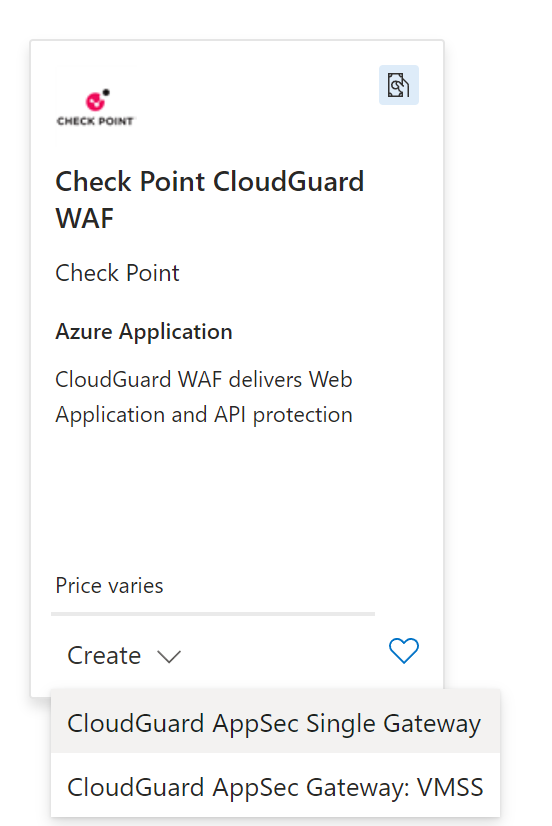

4. Fill in the required fields and click on the `Review + create` button:
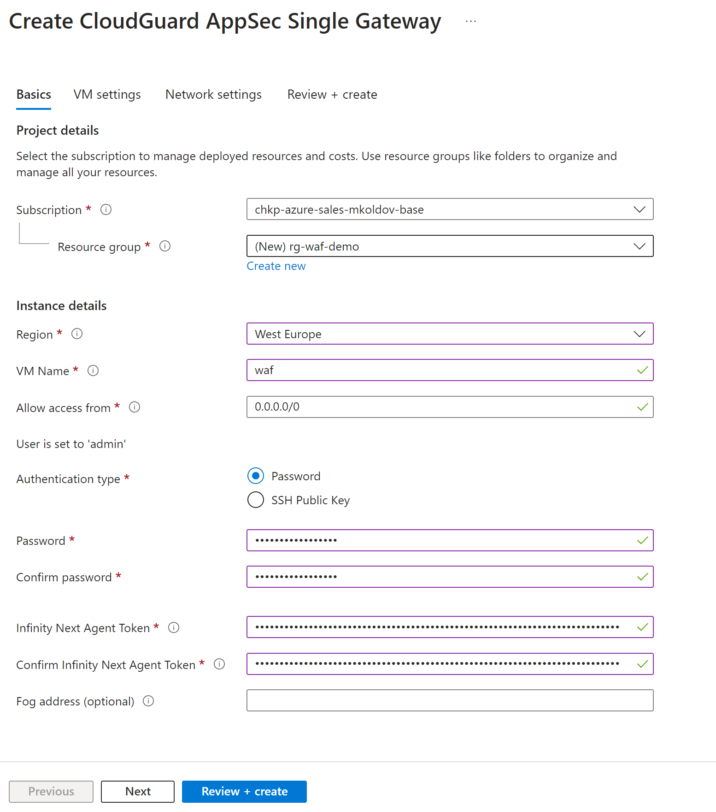
- `Resource Group`: Create a new resource group called `rg-waf-demo`
- `Region`: Choose the region where you want to deploy the WAF - e.g. `West Europe`
- `VM Name`: Enter a name for the VM - e.g. `waf-vm`
- Keep `Allow access from` set to `0.0.0.0/0` - which is from everywhere
- Authentication type: Choose `Password` - e.g. `Welcome@Home#1984` (make sure to remember this password. Username is `admin`)
- `Infinity Next Agent Token`: is essentail for the WAF to connect to the Infinity Portal, fetch policy and upload logs. You can find it in the Infinity Portal by creation of new Profile of type `AppSec Gateway Profile` [here](https://portal.checkpoint.com/dashboard/appsec/cloudguardwaf#/waf-policy/profiles/)
    - Name it `AzureDemoProfile`
    - Environment `Azure`
    - IMPORTANT: make sure to Publish&Enforce the policy before copying the token
    - Copy the token from Authentication section and paste it in the `Infinity Next Agent Token` field in Azure portal
    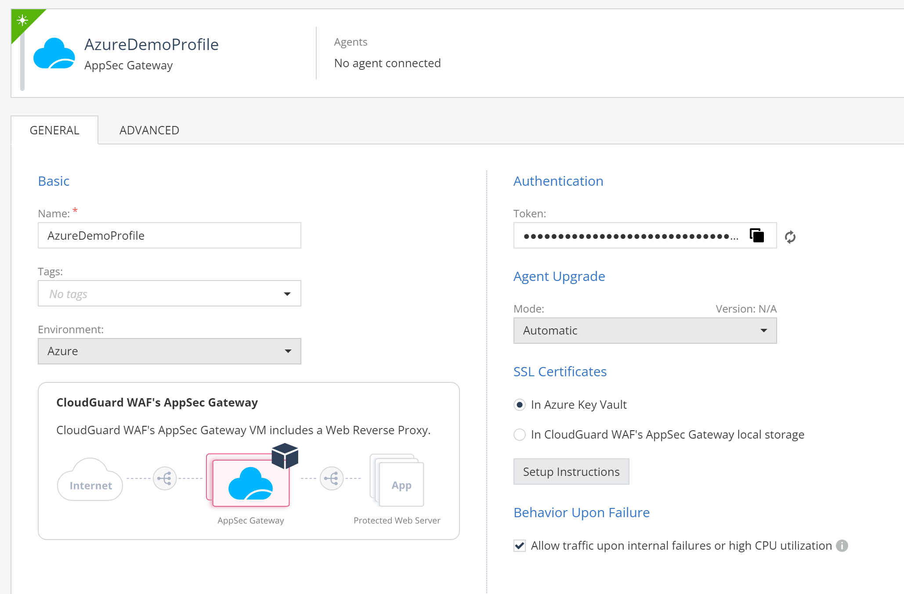
- click `Next` for `VM Settings`
- keep `Virtual machine size` as is
- keep `Assign public IP address to the gateway` enabled as is
- click `Next` for `Network Settings`
- keep all settings as is
- click `Next` for `Review and create`
- click `Create` to deploy the WAF VM

5. Be patient. You may monitor deployment progress in Infinity Portal in WAF's Policy / Agents section ([link](https://portal.checkpoint.com/dashboard/appsec/cloudguardwaf#/waf-policy/agents?status=Connected&tab=general))
You may also find WAF Virtual Machine in Azure Portal ([link](https://portal.azure.com/#browse/Microsoft.Compute%2FVirtualMachines)) and open Serial Console to see Gaia OS booting up.
Process is relatively long (10-15 minutes) as it involves downloading and installing the WAF software during VM initialization.

Once VM is ready, you will see it under agents with VM name, Azure IP address and policy version number of the policy it is enforcing.

6. Find WAF VM hostname assigned by Azure. You may find it in Azure Portal under the VM's `Overview` section. It should look like `waf-cfikg7hwa7yty.westeurope.cloudapp.azure.com` (example). Also notice WAF VM public IP address.
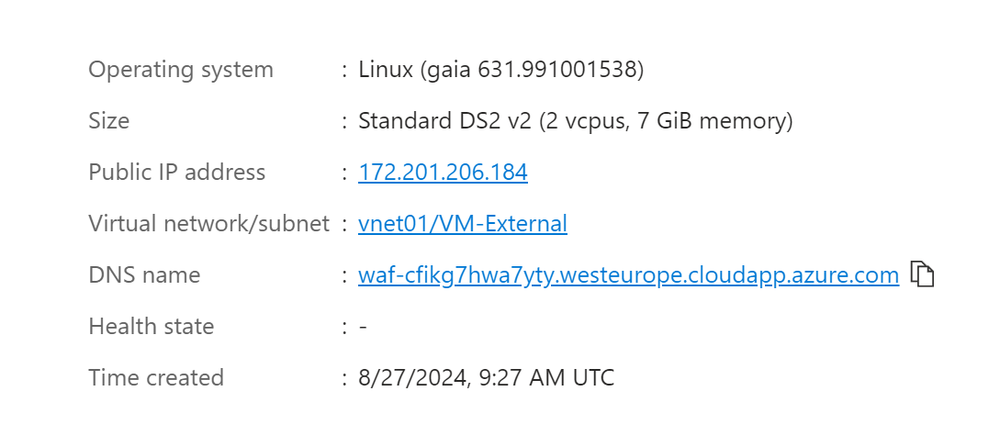

7. We will use WAF VM hostname to create demonstration Web App Asset in WAF policy ([link](https://portal.checkpoint.com/dashboard/appsec/cloudguardwaf#/waf-policy/assets/?tab=attributes))
- Click on `New Asset` icon and choose `Web App`
- Fill in the required fields:
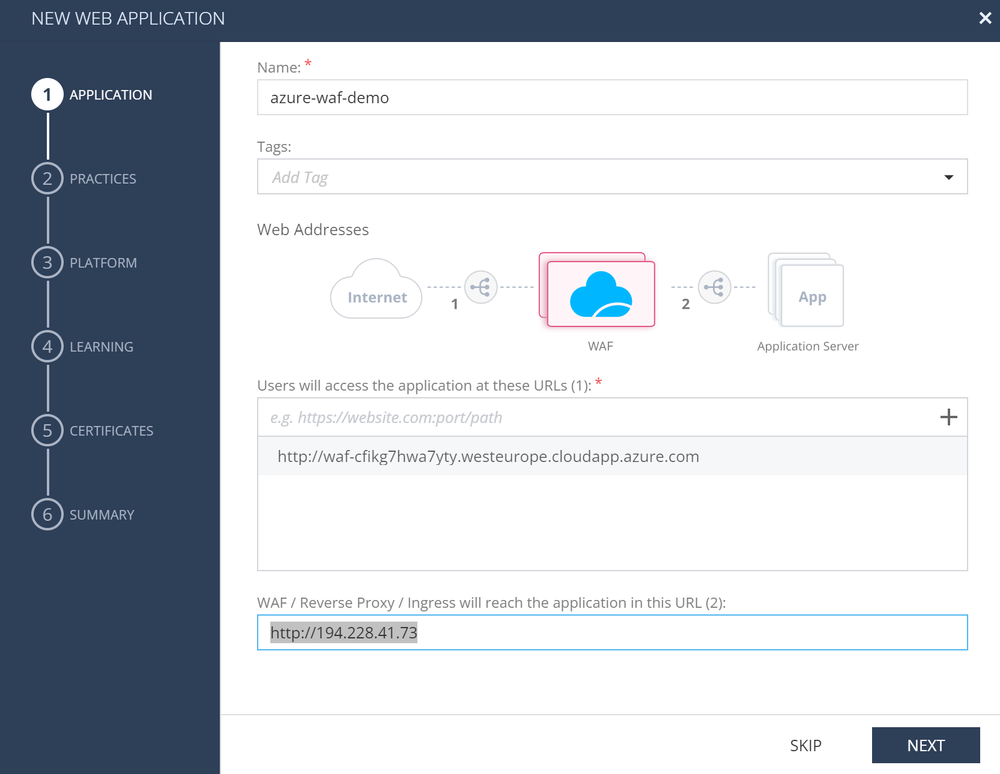
    - `Name`: `azure-waf-demo`
    - Add to `Users will access the application at these URLs (1):` the WAF VM hostname based URL - e.g. `http://waf-cfikg7hwa7yty.westeurope.cloudapp.azure.com` (without trailing slash)
    - remember to click `+` button to add URL to the list
    - set `WAF / Reverse Proxy / Ingress will reach the application in this URL (2):` to `http://194.228.41.73` (no trailing slash). This IP represents application http://ip.iol.cz
    - click `Next`
    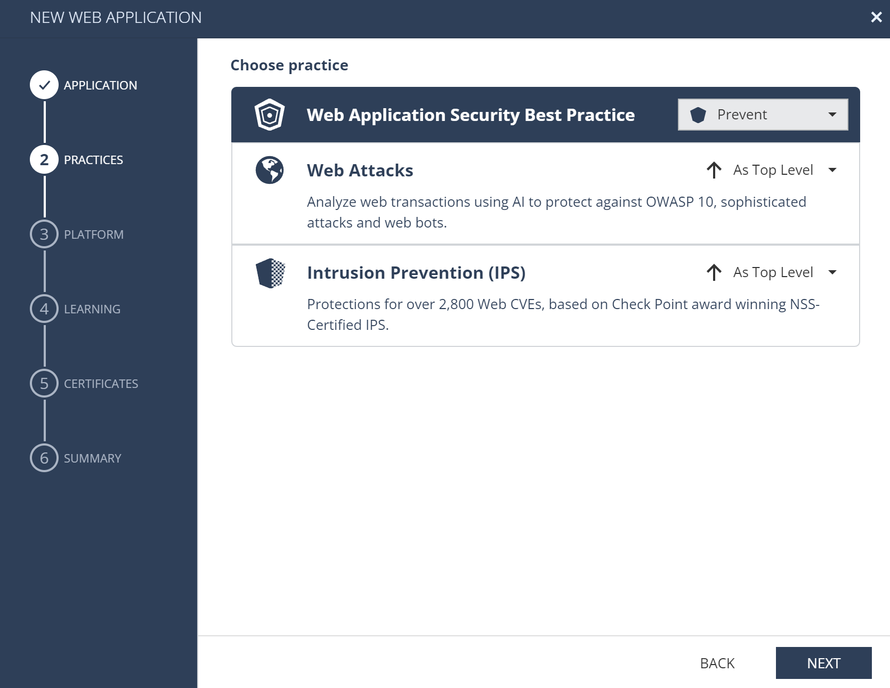
    - Choose `Prevent` to enforce the policy (Web Application Security Best Practice)
    - click `Next`
    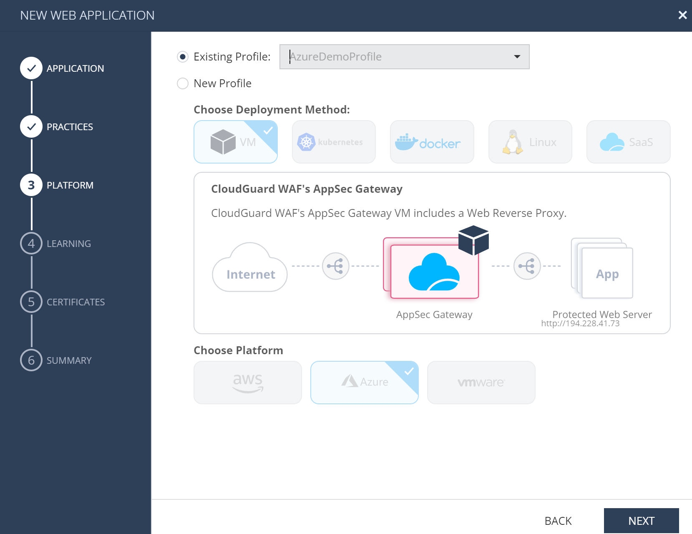
    - choose `Existing profile` we have created befor - `AzureDemoProfile`
    - click `Next`
    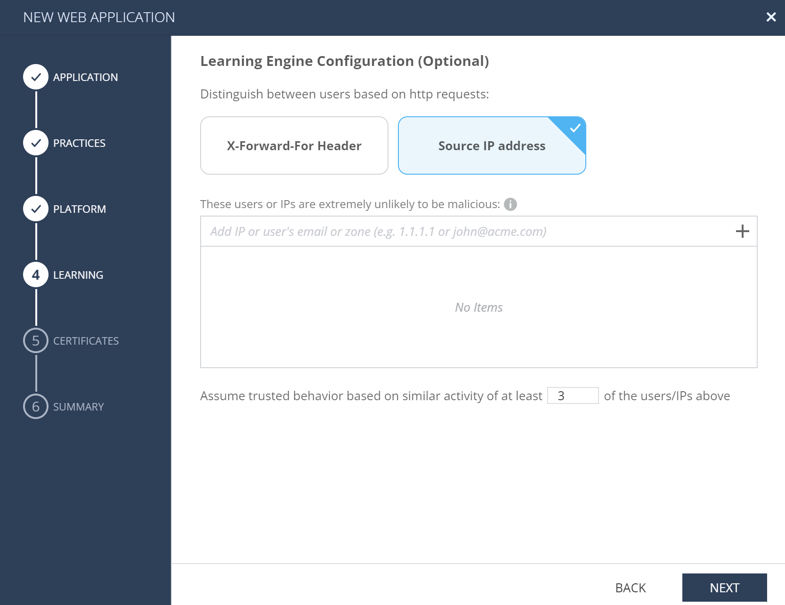
    - VM should be able to see real source IP, so select `Source IP Address` as source identification method
    - click `Next`
    - no certificates setup is needed, so click `Next`
    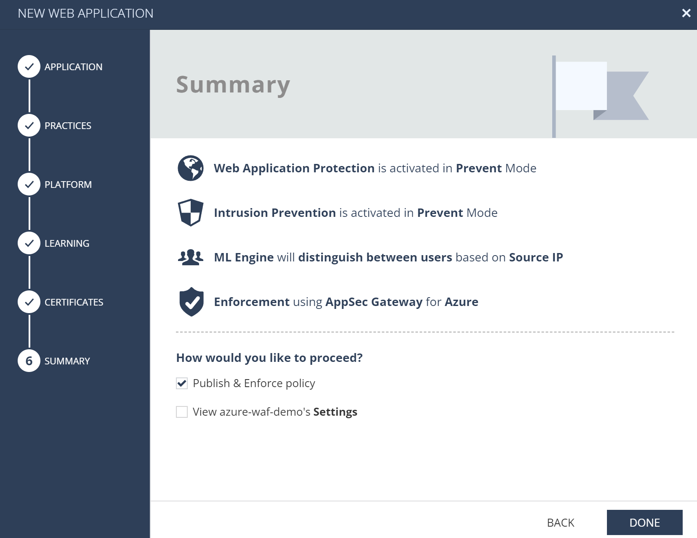
    - click `Done` to publish and enforce the policy
    - you may notice new version number that should later be visible in Agents view ([link](https://portal.checkpoint.com/dashboard/appsec/cloudguardwaf#/waf-policy/agents?status=Connected&tab=general))

8. Now we have WAF VM deployed and policy enforced. We have also created Web App Asset in the policy. Let's test it.

Open browser at URL according your Azure VM hostname: e.g. `http://waf-cfikg7hwa7yty.westeurope.cloudapp.azure.com` Page should show IP address of your WAF VM, because it is proxying your traffic.

9. Optional: You may also access WAF VM - virtual applicance GaiaOS from command line using SSH client. e.g. `ssh admin@waf-cfikg7hwa7yty.westeurope.cloudapp.azure.com` and password you have set during deployment.
    - use `cpnano -s` to check agent status
    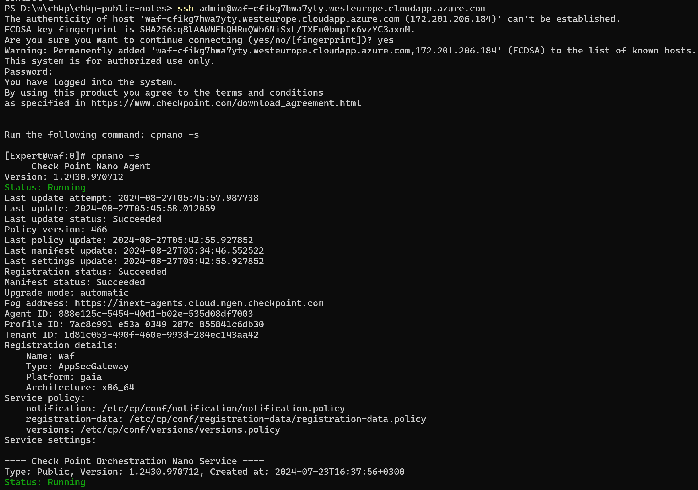

10. Simulate incident by accessing `http://waf-cfikg7hwa7yty.westeurope.cloudapp.azure.com/?test=cat+/etc/passwd` (adopt to your real hostname) and see how WAF is blocking the request.

Application
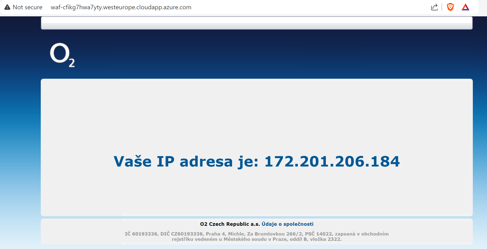

Security Incident
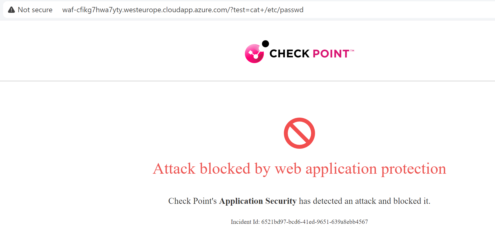

11. Security incident is also visible in Infinity Portal in WAF's Logs section ([link](https://portal.checkpoint.com/dashboard/appsec/cloudguardwaf#/waf-monitor/high-and-critical-wlc/))

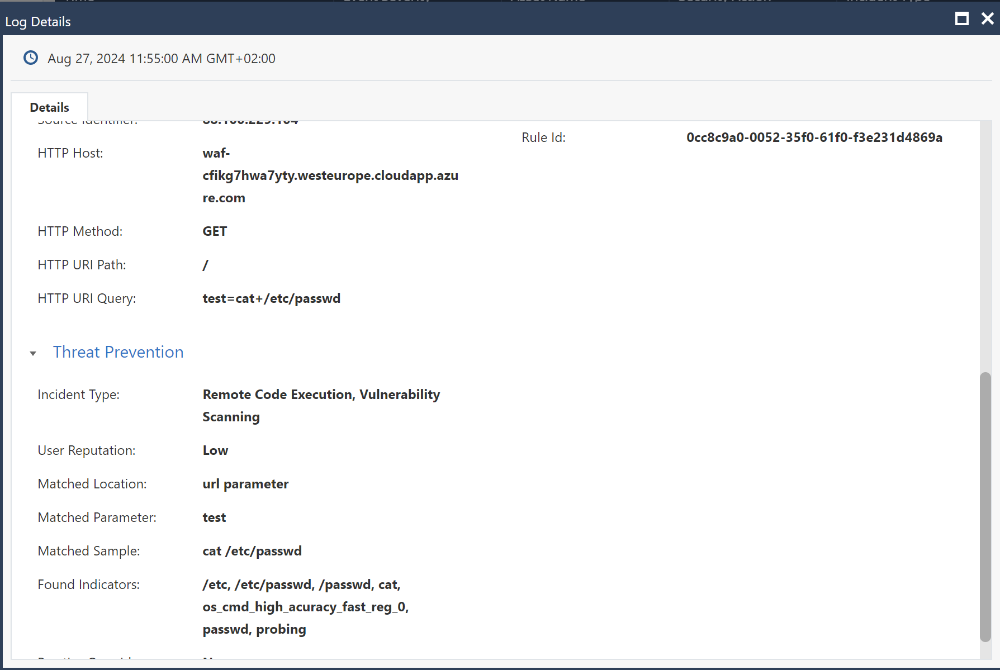

### Cleanup

You may delete the WAF VM by deletion of `rg-waf` resource group in Azure Portal ([link](https://portal.azure.com/#browse/resourcegroups))

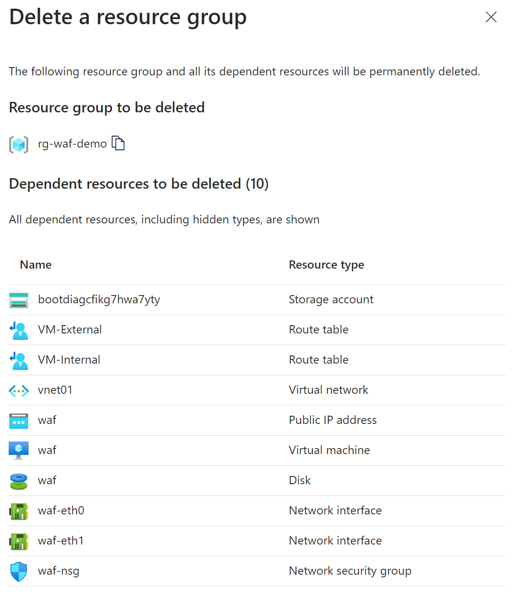

### Summary:

We have seen simple CloudGuard WAF demo deployed in Azure subscription. We have created WAF VM, enforced policy and tested it by accessing the protected application. We have also seen how WAF is blocking malicious requests and how to access logs in Infinity Portal.